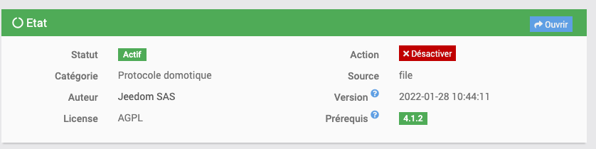
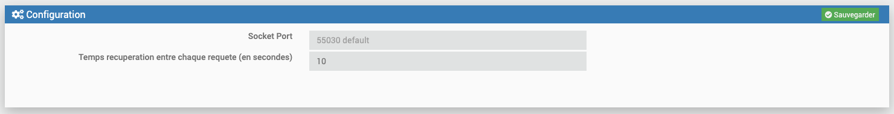

# ModbusTCP

#Description

Plugin permettant de lire et écrire sur vos equipements ModbusTCP/IP

# Configuration du plugin

Après téléchargement du plugin, il faut tout d’abord activer celui-ci, comme tout plugin Jeedom :

Ensuite, il faut lancer l’installation des dépendances (même si elles apparaissent OK) :

Enfin, il faut démarrer le démon :

Rien n’est à modifier dans le champ « Port socket interne » de la section « Configuration ».

Dans ce même onglet, il vous faut choisir la valeur du repos entre l'actualisation de vos équipements (par defaut 5 sec)

# Utilisation du plugin

IMPORTANT :

Pour utiliser le plugin, il vous faut connaitre les parametres de votre entrées/sorties de vos peripheriques modbus (format des données, ordre des bits, etcc...)

Pour les commandes, il y a des parametres a selectionner : 

Details des parametres :
- Valeur negative : pour les formats de type LONG/INT, il faut preciser si la valeur en ecriture/lecture sera negative
- Offset : il s'agit de la prise en compte ou non du decalage dans les numeros de registre sur certains equipements Modbus
- Choisir le pas du slider : Il s'agit de choisir le pas du slider dans le cas d'une commande de type Action/Slider si vous souhaitez envoyer des valeurs non entieres.

COMMANDES DE LECTURE : 

Pour les entrées Coils :  
  - Vous ajouter une Nouvelle I/O ModbusTCP, et vous nommez la commande. Vous choissisez une commande de type Info, sous type Binaire.
  - Dans les parametres, il vous faut choisir Bits comme format. 
    Ensuite il faut choisir le Word Order et le Byte Order (mettre Big par default)
  - Il faut choisir ensuite le registre de départ ainsi que le nombre de bytes a lire (le nombre de registres)
  - Choisir la fonction code adequate : dans ce cas, il faut choisir Fc1 read Coils
  Quand vous sauvegardez, la commande créé sera supprimé, pour créé autant de commandes Coils que le nombre de bytes precisé.
  Ex: Si vous choisissiez un start register à 1 et un nombre de bytes à 4, il sera créé les commandes : ReadCoil_1, ReadCoil_2, ReadCoil_3, ReadCoil_4

  Pour les Holdings Registers :
  - Vous ajouter une Nouvelle I/O ModbusTCP, et vous nommez la commande. Vous choissisez une commande de type Info, sous type Numerique.
  - Choisir le format correspondant : Float ou Long/Integer
  - Le Registre de depart ainsi que le nombre de bytes : pour les floats, le maximum de registres encodé est de 4 registres (64 bits)

COMMANDES D'ECRITURE:

Pour les Coils :

  Exemple pour le registre 1 On:
    - Vous ajouter une Nouvelle I/O ModbusTCP, et vous nommez la commande. Vous choissisez une commande de type Action, sous type Defaut.
    - Format Bits, puis Big First et Big First
    - Registre de depart : 1 
    - Nb de bytes : 1
    - Choisir Fc5 Write Single Coil
    - Mettre 1 dans valeur a envoyer

  Exemple pour le registre 1 Off:
    - Vous ajouter une Nouvelle I/O ModbusTCP, et vous nommez la commande. Vous choissisez une commande de type Action, sous type Defaut.
    - Format Bits, puis Big First et Big First
    - Registre de depart : 1
    - Nb de bytes : 1
    - Choisir Fc5 Write Single Coil
    - Mettre 0 dans valeur a envoyer

  Pour ecrire sur plusieurs Coils :
  
   - Creer une commande, choisir Fc15 Write Multiple Coils
   - Choisir le registre de depart et le nombre de bytes(registres) sur lesquels ecrire.
   - Mettre le byteorder et le wordorder a Big First
   - Remplir Valeur à envoyer aux coils avec les valeurs binaires separées d'un espace . Ex : 0 1 1 0 1 0

Pour les Holdings Registers :

   - Vous ajouter une Nouvelle I/O ModbusTCP, et vous nommez la commande. Vous choissisez une commande de type Action, sous type Slider.
   - Choisir le pas du slider (entier ou decimal)
   - Choisir aussi une valeur Min et Max pour ce slider
   - Choisir le format à envoyer au registre
   - Choisir Fc16 Write Multiple Registers